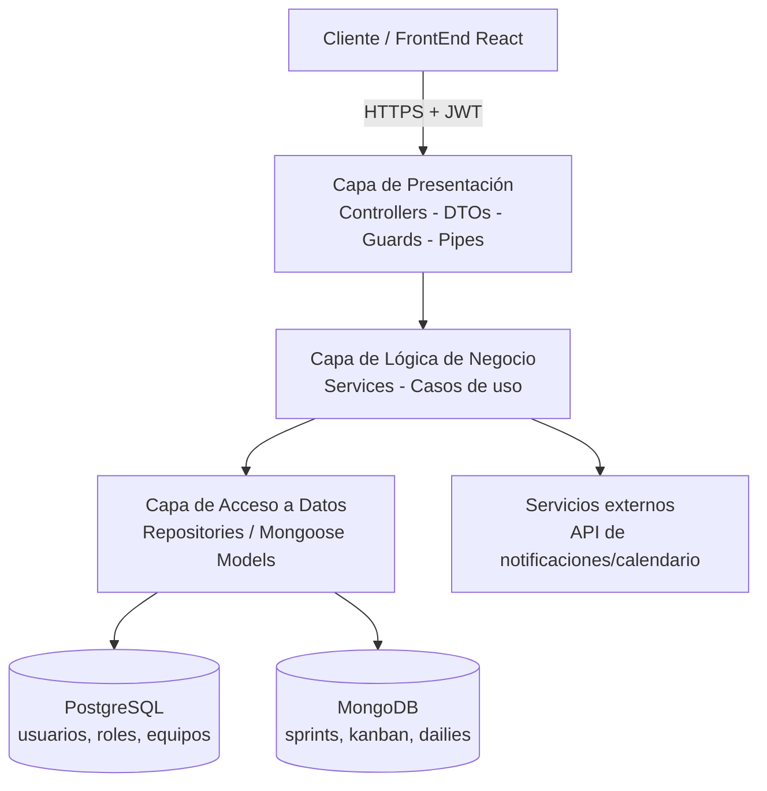

# PAEC Manager — Backend

Sistema de gestión de proyectos escolares bajo la metodología **ABP + Scrum + Design Sprint (Google)**, desarrollado para el CBTis 75 como parte del caso de estudio **"Gestión de Proyectos PAEC"**.

> Servicio BackEnd construido con **NestJS**, arquitectura de **3 capas (Presentación – Lógica de Negocio – Acceso a Datos)** sobre el patrón **MVC**, con persistencia híbrida en **PostgreSQL** (datos relacionales/transaccionales) y **MongoDB** (datos documentales/flujos ágiles).

---

## Descripción del proyecto

Sistema web orientado a la administración de proyectos PAEC del CBTis 75, basado en las metodologías **Aprendizaje Basado en Proyectos (ABP)**, **Design Sprint** y **Scrum**.

El objetivo es digitalizar la planeación, seguimiento y evaluación de proyectos académicos mediante herramientas como tableros Kanban, gestión de Sprints, Dailies, reportes y métricas.

Al inicio de cada semestre la coordinación docente del CBTis 75 asigna una temática PAEC por grupo. Este sistema permite:

- Registrar grupos, docentes, alumnos, equipos y roles ágiles (Scrum Master, Product Owner, Developer).
- Documentar la fase de ideación mediante **Design Sprint de Google** (mapear, bocetar, decidir, prototipar, probar), con evidencias y retroalimentación docente.
- Planear y dar seguimiento a **Sprints** con tablero **Kanban**, historias de usuario, estimaciones y aprobación del Scrum Master.
- Registrar **Dailies** (¿qué hice ayer? / ¿qué haré hoy? / ¿qué me impide avanzar?) por integrante.
- Emitir **alertas automáticas** al Scrum Master cuando no se cumplan entregas en tiempo y forma.
- Generar reportes de avance: esfuerzo por integrante, puntos de historia, diagrama de Gantt, story points planificados vs. completados y horas-persona disponibles.


---

## Antecedentes

Al inicio de cada semestre, la coordinación de docentes del CBTis 75 define una temática para desarrollar proyectos PAEC.

Actualmente el proceso se realiza de manera manual o mediante diversas herramientas dispersas, lo que dificulta el seguimiento de:

- Equipos
- Roles Scrum
- Planeación
- Evidencias
- Avances
- Evaluaciones

Por ello surge la necesidad de desarrollar una plataforma digital que centralice todo el ciclo de vida del proyecto.

---

## Objetivos

- Centralizar la gestión de proyectos.
- Automatizar la metodología Scrum.
- Guiar el proceso de Design Sprint.
- Facilitar la evaluación docente.
- Visualizar métricas del proyecto.

---

## Problemática

- Falta de control centralizado.
- No existe una herramienta para Design Sprint.
- Difícil medir esfuerzo individual.
- Falta de alertas automáticas.
- Registro desorganizado de Dailies.

---
## Requerimientos

### Requerimientos Funcionales

| ID | Requerimiento |
|----|---------------|
| RF1 | Gestión de equipos |
| RF2 | Flujo Design Sprint |
| RF3 | Planeación de Sprint |
| RF4 | Aprobación docente |
| RF5 | Registro de Dailies |
| RF6 | Tablero Kanban |
| RF7 | Sistema de Alertas |
| RF8 | Métricas y Reportes |

### Requerimientos No Funcionales

- Diseño Responsive (Mobile First)
- Alta disponibilidad
- Tiempo de carga menor a 2 segundos
- Control de permisos por roles
- Persistencia en tiempo real

---
## Stack tecnológico

| Capa | Tecnología |
|---|---|
| Framework | NestJS (TypeScript) |
| Base de datos relacional | PostgreSQL (usuarios, roles, grupos, equipos, membresías) |
| Base de datos documental | MongoDB (design sprints, planeación de sprints, dailies) |
| ORM / ODM | TypeORM (Postgres) + Mongoose (MongoDB) |
| Autenticación | JWT + Passport |
| Validación | class-validator / class-transformer |
| Documentación de API | Swagger / OpenAPI |
| Contenedores | Docker + Docker Compose |
| CI/CD | GitHub Actions |
| Testing | Jest (unitarias) + Supertest (e2e) |

## Arquitectura

Arquitectura de **3 capas** aplicada dentro de la estructura modular de NestJS (patrón MVC nativo del framework: *Controller – Service – Repository/Entity*):




- **Presentación (Controllers):** exponen la API REST, validan el request (DTOs + `class-validator`) y aplican `Guards` (JWT/RBAC).
- **Lógica de negocio (Services):** reglas del dominio (aprobación docente, alertas de retraso, cálculo de story points, etc.).
- **Acceso a datos (Repositories/Models):** aísla la persistencia; los servicios nunca hablan directo con TypeORM/Mongoose.

## Estructura de carpetas

```
src/
├── modules/
│   ├── auth/                # Login, JWT, guards, estrategias Passport
│   ├── usuarios/            # Usuarios y roles de sistema (Postgres)
│   ├── grupos/              # Grupos, docentes_grupo (Postgres)
│   ├── equipos/             # Equipos, miembros_equipo, roles_equipo (Postgres)
│   ├── design-sprint/       # Colección design_sprints (Mongo)
│   ├── sprints/             # Colección planeacion_sprints / Kanban (Mongo)
│   ├── dailies/             # Colección dailies (Mongo)
│   ├── alertas/             # Servicio de alertas al Scrum Master
│   └── reportes/            # Gantt, story points, esfuerzo por integrante
├── common/
│   ├── decorators/          # @Roles(), @CurrentUser()
│   ├── guards/              # JwtAuthGuard, RolesGuard
│   ├── filters/             # Manejo global de excepciones
│   ├── interceptors/        # Logging / auditoría
│   └── pipes/               # ValidationPipe global
├── config/                  # Configuración por entorno (Postgres, Mongo, JWT)
├── database/
│   ├── postgres/            # Entidades TypeORM + migraciones
│   └── mongo/                # Schemas Mongoose
├── app.module.ts
└── main.ts
```

Cada módulo sigue internamente el patrón `*.controller.ts` / `*.service.ts` / `*.repository.ts` / `*.entity.ts` (o `*.schema.ts` para Mongo).

## Modelo de datos

### PostgreSQL (relacional) — control de acceso y estructura escolar

- `usuarios`, `roles_usuario`
- `grupos` (temática PAEC y pregunta detonante)
- `docentes_grupo` (N:M docentes ↔ grupos)
- `equipos`, `roles_equipo`, `miembros_equipo` (N:M alumnos ↔ equipos con rol ágil)


### MongoDB (documental) — flujos cambiantes de la metodología

- `design_sprints`: mapeo, herramientas evaluadas, bocetos, storyboard, prototipo, entrevistas de usuario y retroalimentación docente.
- `planeacion_sprints`: sprint por parcial, estado de aprobación docente, tablero Kanban (`actividades_kanban`) con evidencias por alumno.
- `dailies`: acuerdos de reunión y participación individual (ayer / hoy / impedimentos).

> Los documentos de Mongo referencian entidades de Postgres mediante IDs (`equipo_id`, `alumno_id`, `docente_id`) — no hay integridad referencial nativa entre motores, por lo que la validación de existencia se resuelve en la capa de servicio.


## Patrones de diseño implementados

| Patrón | Uso en el proyecto |
|---|---|
| **Repository** | Abstrae el acceso a TypeORM/Mongoose por módulo (`UsuariosRepository`, `SprintsRepository`) |
| **Factory** | Creación de estrategias de notificación/alerta según canal (email, push, calendario) |
| **Singleton** | Conexión a bases de datos (gestionada por el módulo de configuración de Nest) |
| **Dependency Injection** | Nativo de NestJS; usado en todos los servicios y providers |
| **Strategy** | Estrategias de autenticación (Passport JWT) y reglas de alertas de retraso |
| **Decorator** | Guards/decoradores personalizados (`@Roles`, `@CurrentUser`) |
| **Observer (eventos)** | `EventEmitter` de Nest para disparar alertas al Scrum Master ante incumplimientos |

*(Documentar en el código, con comentarios, al menos 5 de estos patrones — requisito de la Actividad 3.)*

## Seguridad y cumplimiento normativo

Alineado a la **Ley General de Protección de Datos Personales en Posesión de Sujetos Obligados** y **OWASP Top 10**:

- **RBAC con JWT:** roles `Estudiante`, `Scrum Master`, `Docente`, `Coordinador`.
- **Hashing de contraseñas:** bcrypt o Argon2.
- **HTTPS obligatorio** en el entorno de despliegue.
- **Validación y sanitización** de todos los datos entrantes (evita SQLi/NoSQLi y XSS almacenado).
- **Minimización de datos:** solo se solicitan/almacenan los campos estrictamente necesarios.
- **Cifrado en reposo** de la base de datos y archivos de configuración sensibles.
- **Derechos ARCO:** endpoints para bloqueo y posterior anonimización/eliminación de datos personales a solicitud del usuario.
- **Bitácoras de auditoría:** registro de quién/cuándo/qué se accedió, sin loguear datos personales en texto plano.
- **Protección contra BOLA:** verificación de pertenencia del recurso (equipo/alumno) antes de exponerlo, no solo el ID recibido.
- **Rate limiting** en `/auth/login` y endpoints de consulta masiva.
- **Mass assignment / excessive data exposure:** DTOs de salida (`class-transformer` con `@Exclude()`) para no exponer contraseñas hash u otros campos sensibles.

## API RESTful

Documentada con Swagger en `/api/docs`. Convención de endpoints (ejemplo):

| Método | Endpoint | Descripción | Código éxito |
|---|---|---|---|
| POST | `/api/v1/auth/login` | Autenticación de usuario | 200 |
| GET | `/api/v1/equipo/:id` | Detalle de equipo | 200 |
| POST | `/api/v1/equipo` | Crear equipo | 201 |
| GET | `/api/v1/historia/:id` | Detalle de historia de usuario / actividad Kanban | 200 |
| PATCH | `/api/v1/historia/:id` | Actualizar estado en el tablero Kanban | 200 |
| POST | `/api/v1/dailies` | Registrar participación en daily | 201 |
| GET | `/api/v1/reportes/gantt/:equipoId` | Diagrama de Gantt del equipo | 200 |

Códigos de estado usados: `200, 201, 400, 401, 403, 404, 500`.

## Variables de entorno

```env
# App
PORT=3000
NODE_ENV=development

# PostgreSQL
POSTGRES_HOST=postgres
POSTGRES_PORT=5432
POSTGRES_USER=paec_user
POSTGRES_PASSWORD=changeme
POSTGRES_DB=paec_relacional

# MongoDB
MONGO_URI=mongodb://mongo:27017/paec_documental

# JWT
JWT_SECRET=changeme
JWT_EXPIRES_IN=1h

# API externa (notificaciones / calendario)
NOTIFICATIONS_API_KEY=changeme
```

## Ejecución local (Docker)

```bash
# 1. Clonar el repositorio
git clone <url-del-repositorio>
cd backend

# 2. Copiar variables de entorno
cp .env.example .env

# 3. Levantar todo el entorno (API + PostgreSQL + MongoDB)
docker-compose up --build

# La API queda disponible en http://localhost:3000
# Documentación Swagger en http://localhost:3000/api/docs
```

`docker-compose.yml` orquesta 3 servicios: `backend`, `postgres`, `mongo`, con volúmenes persistentes para ambas bases de datos.

## CI/CD (GitHub Actions)

Workflow (`.github/workflows/backend-ci.yml`) disparado en cada Pull Request hacia `develop` o `main`:

1. Instalación de dependencias (`npm ci`).
2. Linter (`eslint`).
3. Pruebas unitarias y e2e (`jest`).
4. Build de la imagen Docker.
5. **CD:** al fusionar en `main`, despliegue automático a la nube (Render/Railway/AWS/Azure/GCP) vía webhook/acción de GitHub.

> Evidencia de ejecuciones exitosas (capturas del pipeline) se agrega al `README.md` final del repositorio, requerida como entregable de la Actividad 3.

## Pruebas

```bash
npm run test        # Unitarias
npm run test:e2e    # Integración / end-to-end
npm run test:cov    # Cobertura
```


## Credenciales de prueba

| Rol | Correo | Contraseña |
|---|---|---|
|- | -| - |

## Flujo de trabajo Git

- **GitFlow:** ramas `main`, `develop`, `feature/*`.
- Prohibido push directo a `main`/`develop`.
- Todo cambio ingresa vía **Pull Request**, revisado por al menos otro integrante y con pruebas automatizadas en verde.

## Integrantes del equipo

| Nombre | Número de control | Rol en el equipo |
|---|---|---|
| — | — | Scrum Master |
| — | — | Desarrollador BackEnd |
| — | — | Desarrollador FrontEnd |

## Referencias

OWASP. (2024). *Source Code Analysis Tools*. OWASP. https://owasp.org/www-community/Source_Code_Analysis_Tools

OWASP. (2024). *Vulnerability Scanning Tools*. OWASP. https://owasp.org/www-community/Vulnerability_Scanning_Tools

Wichers, D. (s.f.). *Free for Open Source Application Security Tools*. OWASP. https://owasp.org/www-community/Free_for_Open_Source_Application_Security_Tools
